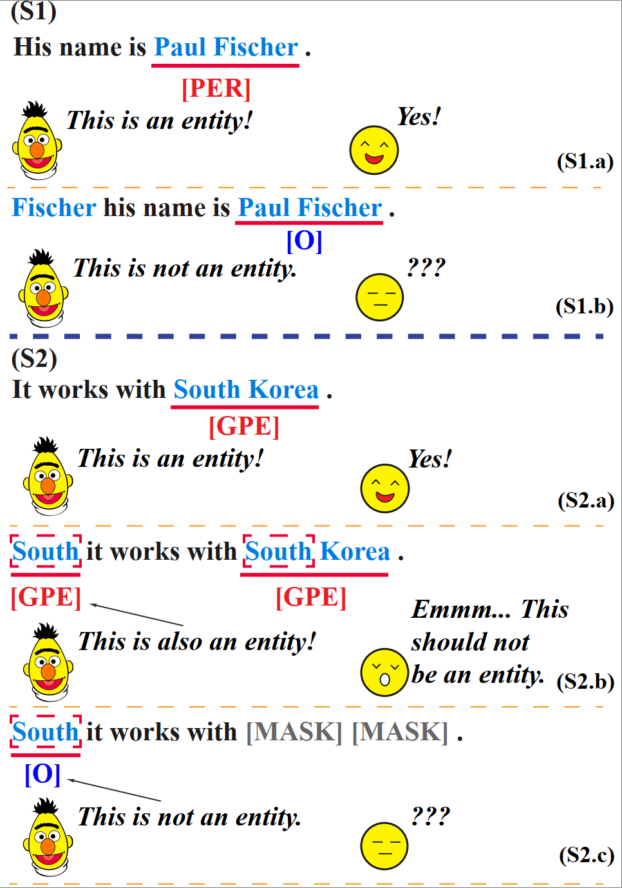

# Attack Named Entity Recognition by Entity Boundary Interference
Source code for COLING 2024 paper titled "[Attack Named Entity Recognition by Entity Boundary Interference](https://arxiv.org/abs/2305.05253)".

<div align="center">
  

  Demonstration of Entity Boundary Interference.
</div>


## Requirements
- python >= 3.7.9
- torch >= 1.7.1
- transformers >= 4.25.1
- scikit-learn >= 1.0
- tqdm >= 4.49.0
- numpy >= 1.20.2


## Model Training and Evaluation


### Description
- The code for finetuning BERT-style model for NER is in `firun_tok_clas.py`.
- `run_tok_clas_at.py` introduces the FreeLB AT training strategy.
- `run_tok_clas_bound.py` and `run_tok_clas_cls.py` can train the victim models in Table4 and Table5 respectively.

### Data Format

We provide the conll-03, msra, ontonotes-5-ch, ontonotes-5-en, wnut-17 datasets in CoNLL format such as:

```
-- O
basically O
, O
it O
was O
unanimously O
agreed O
upon O
by O
the O
various O
relevant O
parties O
. O
```

### Model Training 
You can finetuning a BERT-style model by the script like:
```bash
python run_tok_clas.py \
    --cache_dir ../cache/ \
    --data_dir YOUR_DATA_PATH \
    --do_eval \
    --do_train \
    --eval_batch_size 64 \
    --fp16 \
    --learning_rate 5e-5 \
    --model_type bert-base-uncased \
    --num_train_epochs 6 \
    --output_dir YOUR_OUTPUT_DIR \
    --seed 42 \
    --task_name ontonotes-5-en \
    --train_batch_size 32 \
    --weight_decay 0.8
```
## Hack
You can hack a well trained victim model by running scripy like:
```bash
python hack.py \
    --hack_file YOUR_DATA_FILE \
    --task_name ontonotes-5 \
    --load_model_path bert-base-chinese \
    --do_lower_case \
    --model_file YOUR_VICTIM_MODEL_FILE \
    --cache_dir /home/yangyf/NER-Attack/cache \
    --output_dir YOUR_OUTPUT_DIR
```


## Citation

If you find our work helpful, please consider citing:

```
@article{yang2023attack,
  title={Attack named entity recognition by entity boundary interference},
  author={Yang, Yifei and Wu, Hongqiu and Zhao, Hai},
  journal={arXiv preprint arXiv:2305.05253},
  year={2023}
}
```